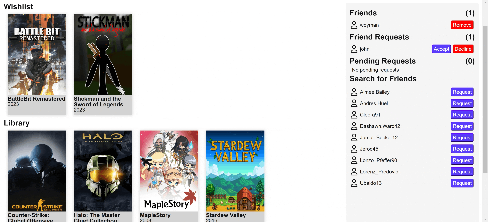

# Well Played


## Background and overview 

Well Played is a video game social media review app where users can add their friends, review games that they own, keep track of all their games, and be able to add unowned games to a wishlist.

<!--- group up with friends or other users to find a new game to play together -->


## [Live Link](https://well-played.onrender.com/)

## Technologies Used

Well Played is built on the MERN stack.

### Backend:

**MongoDB**: NoSQL database that stores data in JSON like documents, which allows easy changes such as new fields in the model.

**Express.js**: Framework used to easily create RESTful API in Node, as well as manage databases.
 
**Node.js**: Runtime environment that allows Javascript to be run on the server.

### Frontend:

**React.js**: Library used to create dynamic user interfaces, allowing the reuse of components.

**Redux**: Framework used to manage state across the whole app.

### Others:
**[IGDB Video Games API](https://www.igdb.com/)**: API utilized to fetch video game information vital to Well Played.

## Features

### Video Game Search
Users are able to search for video games with or without filters. In the search page, results are returned with basic information. Upon clicking the game, users are able to see more details about a game. In both the search page and in the game show page, users are able to add and remove the game from their wishlist and library by clicking on their respective buttons.


### User Wishlist and Library 
In the search page and in the game show page, users are able to add games to their wishlist and library by click on the icons. Whenever they are clicked, depending on whether or not the video game is currently in the user's lists, the corresponding game is added or removed to the user's list.


### Game Reviews and Ratings
In the game show page, users are able to see user reviews for the game as well as leave their own review. Reviews consist of a description as well as different ratings pertaining to: gameplay, story, and visuals.


### User Profile 
The user profile contains both the user's wishlist and library lists of games. Users are also able to manage their friends in the friendslist.


### Friends
Users are able to send and receive friend requests. The receiver is able to accept or deny the friend request. Users are also able to remove friends from their friendlist.


## Featured Code
```
Insert Code Here
```


## Future Features
 - Game Night with Friends/Looking for Group
 - Custom User lists
 - Steam/Xbox/Playstation Integration
 - Discord OAuth
 - AI Generated Recommendations using OpenAI API

## Team Members
- [Justin Aitken](https://www.linkedin.com/in/justin-aitken-bb9272212/)
- [Weyman Leung](https://www.linkedin.com/in/weyman-leung/)
- [Julio Uribe](https://www.linkedin.com/in/julio-uribe-a15736b5/)

<!-- ## Background and overview 

Well played is a video game social media review app where users can add their friends, review games that they own, keep track of all their games, add unowned games to a wishlist and
group up with friends or other users to find a new game to play together


## [Live Link](https://well-played.onrender.com/)


## Functionality and MVP 

 - User authentication
 - Games database and game show
 - Friends list
 - Wish-list
 - User library of owned games
 - Game reviews

#### Bonus
 - Game night with friends
 - Looking for Group
 - Custom User lists
 - Steam/Xbox/Playstation integration
 - Discord OAuth
 - Ai generated recommendations

## Technologies and Technical Challenges

#### Technologies used

 - Backend
   - MongoDB
   - Express.js
   - IGDB - Video game api 
   - Node

 - Frontend
   - React-Redux
  
### Technical Challenges

  We have a list of technologies that we would like to integrate into the app, but are unfamilliar with them and hope to learn how they work throughout development

  - Steam integration (populate owned games and wishlist)
  - Discord OAuth (Sign in with discord)
  - Open Ai integration for recommendations
  - Game night
    - Might have trouble recreating a full outer join in a noSQL database

## Group members and Work Breakdown

- Justin Aitken - Flex dev
- Julio Uribe - Frontend Specialist
- Weyman Leung - Backend Specialist

### Day by Day

Monday
- Initial Setup
- User Auth
- Flesh out schema

Tuesday
- Build games table 
- Friends Feature
- Owned Games/wishlist
- Barebones games show
- Search if time

Wednesday
- Search function
- Finished Games show
  - Reviews
  - News-feed

Thursday
- Strengthen features, dotted T's, crossed I's
- Flesh out css

Friday
- Finish main crud features
- Start Game night and LFG
- Plan out work for weekend

---

### Screenshots

- Home page
  


- Game search
  


- Game show
  


-->
